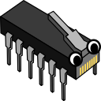

# Emulator Network Access : NWA

## Overview

The Emulator Network Access protocol is way for application to be able to communicate with an emulator.
The most common usage is to access the memory of the current game running to do thing like tracking item for randomizer

It was designed and created by people working on application like QUsb2snes or SNI to have a more reliable mean to access
and control emulator than through Lua script or the poor interface of RetroArch. Even if the main current use is
for SNES games, it was designed without a particular plateform in mind.

## Existing emulator

- Snes9x-nwa: [github.com/Skarsnik/snes9x-emunwa](https://github.com/Skarsnik/snes9x-emunwa/releases)
- Bizhawk via an external tool: [github.com/Skarsnik/Bizhawk-nwa-tool](https://github.com/Skarsnik/Bizhawk-nwa-tool/releases)
- bsnes-plus nwa fork: [github.com/black-sliver/bsnes-plus](https://github.com/black-sliver/bsnes-plus/releases)

## Compatible application

- QUsb2Snes: [skarsnik.github.io/QUsb2snes](https://skarsnik.github.io/QUsb2snes/)
- SNI: [github.com/alttpo/sni](https://github.com/alttpo/sni/releases)
